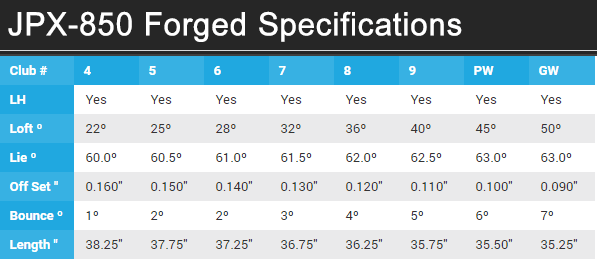

DRIVER SHAFT
- ROGUE BLACK 60S 68 GRAMS MID BEND POINT 3.6* TORQUE 

WEDGES
- Titleist Vokey 
- SM6 54F 14
- SM6 58K 8
- 2018 Mack Daddy PM - Phil Mickelson
- 60.10
- MP-T5 Mizuno White Satin
- 52.06
- 56.10
- 60.06
- Mizuno T-7 55.09

