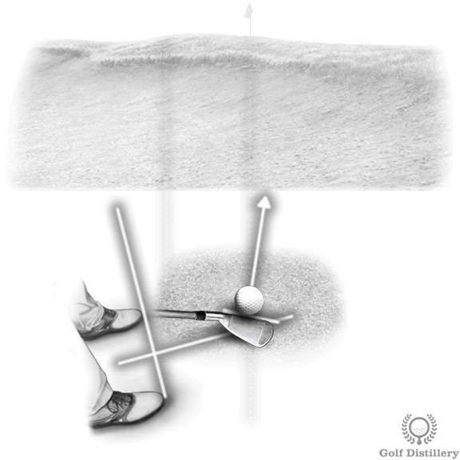

## Setup

## Good Lie

- Open club face
- Use open stance
- Weight more on the left
- Aim left of target
- dig feet in (helps get you below the ball)
- Hit 2" behind the ball and follow thru

## Bad Lie & Hard sand

- Closed face
- use wedge
- Hit 1" behind ball

